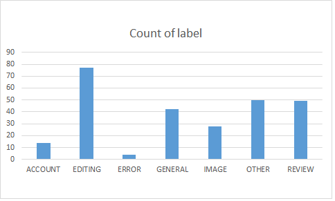

# Analysis of Indonesian Wikipedia's Flow board

- Analysis of questions asked on [id:Wikipedia:Warung Kopi (Bantuan)](https://id.wikipedia.org/wiki/Wikipedia:Warung_Kopi_(Bantuan)).
- Dataset timestamp spans from board creation on 1 May 2016 up to 19 Nov 2016, containing 264 rows.
- Objective: manually label dataset and report summary of the data.
- Labels:
  - General: General questions, knowledge-related question
  - Editing: Question on how to edit Wikipedia
  - Image: Question on how to upload images
  - Review: Request of page review (FlaggedRev, revert, deletion, or other kind)
  - Account: Account-related questions (registration, log in, etc)
  - Error: Error reporting. Pointing out error in article
  - Others

## Methods
- Retrieve contents (via API) [done]
  - Run at [PAWS](http://paws.wmflabs.org/), exported Python file is available at `script_generate_data.py`
  - stored as `flow1.json`, `flow2.json`, `flow3.json`
- Combine those into meaningful dataset [done]
  - "`script_combine_data.py`" was run
  - Results: `flow_combined.json` (plus `flow_combined.csv`, converted via https://json-csv.com/)
- Label the dataset
  - Available at `flow_combined_labelled.csv`
- Make summary & draw conclusions

## Results and Discussions

From the label count, questions on the Flow board are on the topics of:

1. Editing: This is probably due to the high barrier on editing, where newly registered users do not know how to edit Wikipedia. This might be due to tutorial pages not being effective enough to attract attention of newly registered user or they simply do not bother to read the tutorials. Since mobile user access is rising, this might also be even more true as editing on mobile is a really bad experience as users were presented with raw wikitext with no hint at all.
2. Other: mostly greetings or unrelated statements. Probably due to this page being viewed as a forum.
3. Review: mostly request for page review (due to FlaggedRevs) or protest on why article is deleted. For the latter, this shows that users do not read the local policy of allowed articles before creating article.
4. General: maybe this is because Wikipedia being perceived as omniscient. Though containing knowledge-related questions, those that couldn't be found in Wikipedia (e.g. how to find job) are categorized as "Other".
5. Image: how to upload image. Yeah, UX of uploading image is horrible.
6. Account: how to rename username, how to register (some even ask this after registering), etc. Maybe due to "Register/Log in" button being barely visible at top-right of desktop site's page.
7. Error: Reporting of error in article text. Not sure why they don't just directly edit the page.

During labelling, it is found that there was also a lot of mention about how to create profile (keyword spotting: 27 times occurrence) or biography (keyword spotting: 12 times occurrence), in which it was labelled as "editing". This might be due to registered users' motivation being creating article about themselves in Wikipedia, which was now allowed under local policy.

## Conclusion and Future Work

In conclusion, this work has grouped the questions newly registered users have on Indonesian Wikipedia. Hopefully this could be useful to improve the onboarding process so that there were more active editors on Indonesian Wikipedia.

Data of whether user asking the question was accessing via desktop or mobile was unavailable. The editing experience on the two sites were quite different and may greatly affect the onboarding process.

Future works include:
- Validation of current labelling, since it is done by only one person
- Automated labelling based on current dataset
- Break out "Others" group into finer-grained groups
